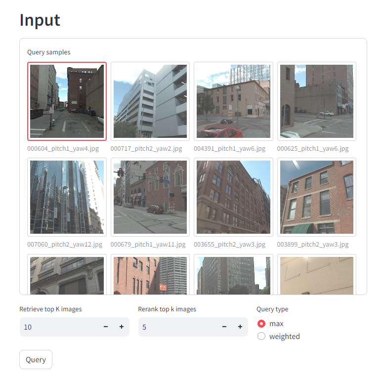

# Enhanced Visual Localization Framework in Urban Environments

### Summary
Global positioning is crucial in fields that rely on precise and efficient means of extracting environmental information. With ever increasing interest in autonomous robotics, the need for higher precision and reliability has exceeded the current capability of satellite-based systems (GPS). In response, visual localization models have been developed with hope that, through mass collection data, we can leverage machine learning in computer vision to, more accurately and consistently, determine an object’s position and orientation. In this work, we propose a framework for this task that can utilize the advantages of the image retrieval model and the pose regression model. In doing so, our approach is very flexible and requires less data for training, which can be scaled up easily. The experiments demonstrate that our approach can yield good estimation results with less training effort.

### Structure
Given an image as the input, we aim to estimates the location and orientation of the device used to capture it. First, the Visual Pose Regression (VPR) module retrieves K reference images, depicting the scenes most similar to the query image. Then, the Relative Pose Regression (RPR) module performs a pose regression for each pair of query-reference images to obtain potential poses of the query image. Finally, the query image's pose is selected based on the confidence estimate of each regression performed.

### Baselines
We followed the architecture proposed in MixVPR, which implements a new aggregation method to convert global features into scene descriptors. The model is further fine-tuned based on our new frustum-dependent mining strategy to help place emphasis on similarity in viewing angles between the query image and reference images.

We elected to follow the process of Feature Matching and Scale from Estimated Depth (Ess.Mat + D.Scale) from Map-free Visual Relocalization. The output of this module is the difference in translation and orientation between the reference-query image pair. The number of point correspondences that correlate with this transformation is used to estimate a confidence value. This ensures only predictions founded on valid grounds can be considered successful.

Reference images retrieved from the VPR module run the risk of sharing little overlap with the query image, creating faulty correspondences. Therefore, we propose a new mining strategy based on the Multi-Similarity Miner and Loss to ensure high overlaps of visual features between images.

### Results
Our method is evaluated on Pittsburgh250k-test dataset and Cambridge Landmark dataset. The metrics used are median translation error (Positions - meters), median rotation error (Orientation - degrees) and successful rate of the process.

<table>
<thead>
  <tr>
    <th rowspan="2">Baseline</th>
    <th colspan="3">Pitts250k-test</th>
    <th colspan="3">Cambridge Landmark</th>
  </tr>
  <tr>
    <th>Successful Rate</th>
    <th>Position (meters)</th>
    <th>Orientation (degrees)</th>
    <th>Successful Rate</th>
    <th>Position (meters)</th>
    <th>Orientation (degrees)</th>
  </tr>
</thead>
<tbody>
  <tr>
    <td>EssNet</td>
    <td> - </td>
    <td> - </td>
    <td> - </td>
    <td>1.00</td>
    <td>10.40</td>
    <td>85.80</td>
  </tr>
  <tr>
    <td>NC-EssNet</td>
    <td> - </td>
    <td> - </td>
    <td> - </td>
    <td>1.00</td>
    <td>7.98</td>
    <td>24.40</td>
  </tr>
  <tr>
    <td>Relformer</td>
    <td> - </td>
    <td> - </td>
    <td> - </td>
    <td>1.00</td>
    <td>3.35</td>
    <td>10.60</td>
  </tr>
  <tr>
    <td>NetVLAD</td>
    <td>1.00</td>
    <td>84.88</td>
    <td> - </td>
    <td>1.00</td>
    <td>3.99</td>
    <td>10.03</td>
  </tr>
  <tr>
    <td>AnyLoc</td>
    <td>1.00</td>
    <td>42.56</td>
    <td> - </td>
    <td>1.00</td>
    <td>4.46</td>
    <td>10.42</td>
  </tr>
  <tr>
    <td>MixVPR</td>
    <td>1.00</td>
    <td>21.82</td>
    <td> - </td>
    <td>1.00</td>
    <td>4.04</td>
    <td>7.44</td>
  </tr>
  <tr>
    <td>Ours</td>
    <td>0.99</td>
    <td>18.32</td>
    <td> - </td>
    <td>1.00</td>
    <td>3.19</td>
    <td>4.80</td>
  </tr>
</tbody>
</table>

### Demo

### Acknowledgements
Parts of this project are inspired by the following repositories:
- [MixVPR](https://github.com/amaralibey/MixVPR/tree/main)
- [Map-free Visual Relocalization](https://github.com/nianticlabs/map-free-reloc)
